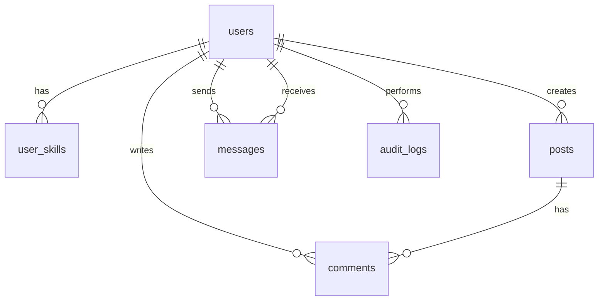

# 📚 وثيقة شرح قاعدة بيانات تطبيق الشبكة الاجتماعية

## 🚀 نظرة عامة
تُشكل قاعدة البيانات العمود الفقري لتطبيق شبكة اجتماعية، حيث تدير **المستخدمين**، **المنشورات**، **التعليقات**، **الرسائل**، **مهارات المستخدمين**، و**سجلات التدقيق**. تم تصميمها باستخدام **SQLite** مع التركيز على:
- 🛠 **الأداء**: باستخدام الفهرسة (Indexes) لتسريع الاستعلامات.
- 🔒 **سلامة البيانات**: من خلال القيود والمفاتيح الأجنبية.
- 🌐 **سهولة التكامل**: لتسهيل عمل مطوري الواجهة الأمامية.

يوفر هذا المستند شرحًا شاملاً ومبسطًا لهيكلية قاعدة البيانات، مع أدوات بصرية لتسهيل الفهم.

---

## 🗂 ملخص الجداول
الجدول التالي يُلخص الجداول، أغراضها، والمؤشرات المرتبطة:

| الجدول           | الغرض                              | الأعمدة الرئيسية                          | المؤشرات                     |
|-------------------|------------------------------------|-------------------------------------------|------------------------------|
| `users`          | إدارة بيانات المستخدمين           | `id`, `email`, `role`, `photo`            | `idx_users_email`            |
| `user_skills`    | تخزين مهارات المستخدمين          | `user_id`, `skill`                        | -                            |
| `posts`          | إدارة المنشورات                   | `id`, `title`, `content`, `user_id`       | `idx_posts_user_id`          |
| `messages`       | تخزين الرسائل بين المستخدمين     | `id`, `content`, `sender_id`, `receiver_id` | `idx_messages_sender_id`, `idx_messages_receiver_id` |
| `comments`       | إدارة التعليقات على المنشورات    | `id`, `content`, `user_id`, `post_id`     | `idx_comments_post_id`, `idx_comments_user_id` |
| `audit_logs`     | تتبع الأنشطة الإدارية            | `id`, `action`, `admin_id`, `created_at`  | -                            |

---

## 🖼 هيكلية قاعدة البيانات (رسم تخطيطي)
لتصور العلاقات بين الجداول، يمكن استخدام الرسم التخطيطي التالي (تم إنشاؤه باستخدام [Mermaid](https://mermaid.js.org/)):

📌 **كيفية عرض الرسم**:
- انسخ الكود أعلاه إلى [Mermaid Live Editor](https://mermaid.live/) لعرض الرسم التخطيطي.
- العلاقات تُظهر كيف ترتبط الجداول عبر المفاتيح الأجنبية (مثل `user_id` و`post_id`).

---

## 📋 تفاصيل الجداول

### 1. جدول `users` (المستخدمون)
**الغرض**: تخزين بيانات المستخدمين وأدوارهم.

#### الأعمدة:
- `id`: 🆔 معرف فريد (مفتاح أساسي، يتزايد تلقائيًا).
- `first_name`: ✍️ الاسم الأول (مطلوب).
- `last_name`: ✍️ الاسم الأخير (مطلوب).
- `email`: 📧 بريد إلكتروني فريد (مطلوب).
- `password`: 🔑 كلمة مرور مشفرة (مطلوب).
- `department`: 🏢 القسم/التخصص (مطلوب).
- `photo`: 🖼 رابط الصورة الشخصية (اختياري).
- `role`: 🎭 دور المستخدم (`user` أو `admin`، افتراضي: `user`).

#### المؤشرات:
- `idx_users_email`: لتسريع البحث عن البريد الإلكتروني.

#### نصائح للواجهة الأمامية:
- 📋 استخدم نموذج تسجيل مع التحقق من تكرار `email`.
- 🖼 دعم تحميل الصور مع صورة افتراضية لـ`photo`.
- 🎨 اعرض `role` كقائمة منسدلة.

---

### 2. جدول `user_skills` (مهارات المستخدمين)
**الغرض**: ربط المستخدمين بمهاراتهم.

#### الأعمدة:
- `user_id`: 🆔 معرف المستخدم (مفتاح أجنبي).
- `skill`: 💡 اسم المهارة (مطلوب).
- **المفتاح الأساسي**: (`user_id`, `skill`).

#### العلاقات:
- 🧩 `user_id` يرتبط بـ`users(id)` مع حذف تلقائي (`ON DELETE CASCADE`).

#### نصائح للواجهة الأمامية:
- 📑 اعرض المهارات كقائمة قابلة للتحرير في ملف المستخدم.
- 🔍 أضف فلترة حسب المهارات في واجهة البحث.

---

### 3. جدول `posts` (المنشورات)
**الغرض**: إدارة المنشورات التي ينشئها المستخدمون.

#### الأعمدة:
- `id`: 🆔 معرف فريد (مفتاح أساسي).
- `title`: 📜 عنوان المنشور (مطلوب).
- `content`: 📝 نص المنشور (مطلوب).
- `image`: 🖼 رابط الصورة (اختياري).
- `created_at`: 🕒 تاريخ الإنشاء (مطلوب).
- `user_id`: 🆔 معرف المستخدم (مفتاح أجنبي).

#### العلاقات:
- 🧩 `user_id` يرتبط بـ`users(id)` مع حذف تلقائي.

#### المؤشرات:
- `idx_posts_user_id`: لتسريع استرجاع المنشورات حسب المستخدم.

#### نصائح للواجهة الأمامية:
- 🖼 اعرض الصور إذا وُجدت، مع صورة افتراضية.
- 🕒 نسّق `created_at` باستخدام مكتبات مثل `date-fns`.
- 👤 أضف رابطًا لملف تعريف صاحب المنشور.

---

### 4. جدول `messages` (الرسائل)
**الغرض**: إدارة الرسائل بين المستخدمين.

#### الأعمدة:
- `id`: 🆔 معرف فريد (مفتاح أساسي).
- `content`: 📝 نص الرسالة (مطلوب).
- `created_at`: 🕒 تاريخ الإرسال (مطلوب).
- `sender_id`: 🆔 معرف المرسل (مفتاح أجنبي).
- `receiver_id`: 🆔 معرف المستلم (مفتاح أجنبي).

#### العلاقات:
- 🧩 `sender_id` و`receiver_id` يرتبطان بـ`users(id)` مع حذف تلقائي.

#### المؤشرات:
- `idx_messages_sender_id`, `idx_messages_receiver_id`: لتسريع استعلامات الرسائل.

#### نصائح للواجهة الأمامية:
- 💬 صمم واجهة محادثة مع ترتيب زمني.
- 🔔 أضف إشعارات للرسائل الجديدة.

---

### 5. جدول `comments` (التعليقات)
**الغرض**: إدارة التعليقات على المنشورات.

#### الأعمدة:
- `id`: 🆔 معرف فريد (مفتاح أساسي).
- `content`: 📝 نص التعليق (مطلوب).
- `created_at`: 🕒 تاريخ الإنشاء (مطلوب).
- `user_id`: 🆔 معرف المستخدم (مفتاح أجنبي).
- `post_id`: 🆔 معرف المنشور (مفتاح أجنبي).

#### العلاقات:
- 🧩 `user_id` يرتبط بـ`users(id)`، و`post_id` يرتبط بـ`posts(id)` مع حذف تلقائي.

#### المؤشرات:
- `idx_comments_post_id`, `idx_comments_user_id`: لتسريع الاستعلامات.

#### نصائح للواجهة الأمامية:
- 📜 اعرض التعليقات أسفل المنشورات مع صورة المستخدم.
- 🔄 أضف خاصية "تحميل المزيد" للتعليقات.

---

### 6. جدول `audit_logs` (سجلات التدقيق)
**الغرض**: تتبع الأنشطة الإدارية.

#### الأعمدة:
- `id`: 🆔 معرف فريد (مفتاح أساسي).
- `action`: 🔧 الإجراء (مطلوب).
- `resource_type`: 📋 نوع المورد (مطلوب).
- `resource_id`: 🆔 معرف المورد (مطلوب).
- `admin_id`: 🆔 معرف المشرف (مفتاح أجنبي، اختياري).
- `details`: 📝 تفاصيل إضافية (اختياري).
- `created_at`: 🕒 تاريخ الإجراء (مطلوب).

#### العلاقات:
- 🧩 `admin_id` يرتبط بـ`users(id)` مع تعيين `NULL` عند الحذف.

#### نصائح للواجهة الأمامية:
- 🖥 صمم واجهة إدارية لعرض السجلات.
- 🔍 أضف فلترة حسب `action` أو `resource_type`.

---

## 🛠 نصائح لتطوير الواجهة الأمامية
1. **إدارة الصور** 📷:
   - استخدم مكتبات مثل `react-dropzone` لتحميل الصور.
   - خزن مسارات الصور في `users.photo` و`posts.image`.

2. **التواريخ** 🕒:
   - استخدم `moment.js` أو `date-fns` لتنسيق `created_at`.

3. **الأداء** ⚡:
   - استخدم التحميل التدريجي (Pagination) للمنشورات والتعليقات.
   - استفد من المؤشرات لتسريع الاستعلامات.

4. **الأمان** 🔐:
   - تحقق من `role` قبل السماح بالوظائف الإدارية.
   - نفّذ التحقق من الإدخال (Validation).

5. **تجربة المستخدم** 🌟:
   - أضف إشعارات فورية للرسائل والتعليقات.
   - دعم ميزات تفاعلية مثل "الإعجاب" إذا طُلب.

---

## 🎯 الخلاصة
تم تصميم قاعدة البيانات لتكون **مرنة**، **فعالة**، و**سهلة التكامل**. الجداول، العلاقات، والمؤشرات تُسهل بناء واجهات مستخدم تفاعلية. استخدم الرسم التخطيطي والجدول أعلاه لفهم الهيكلية، وتواصل مع فريق التطوير الخلفي لأي استفسارات إضافية.